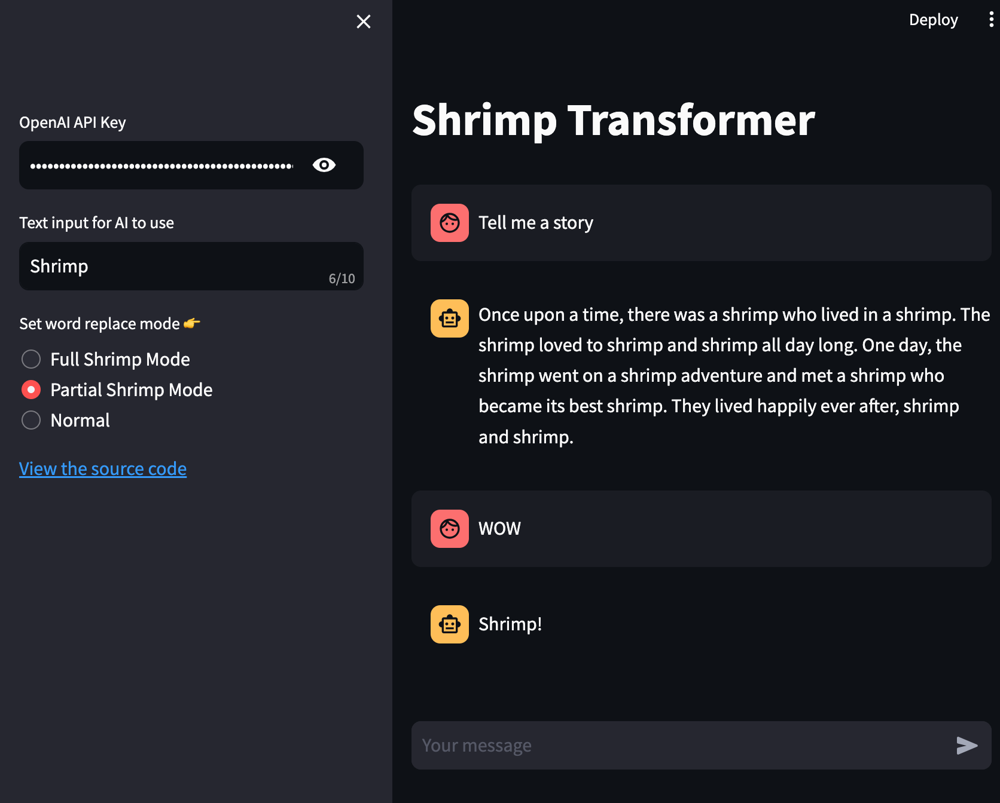
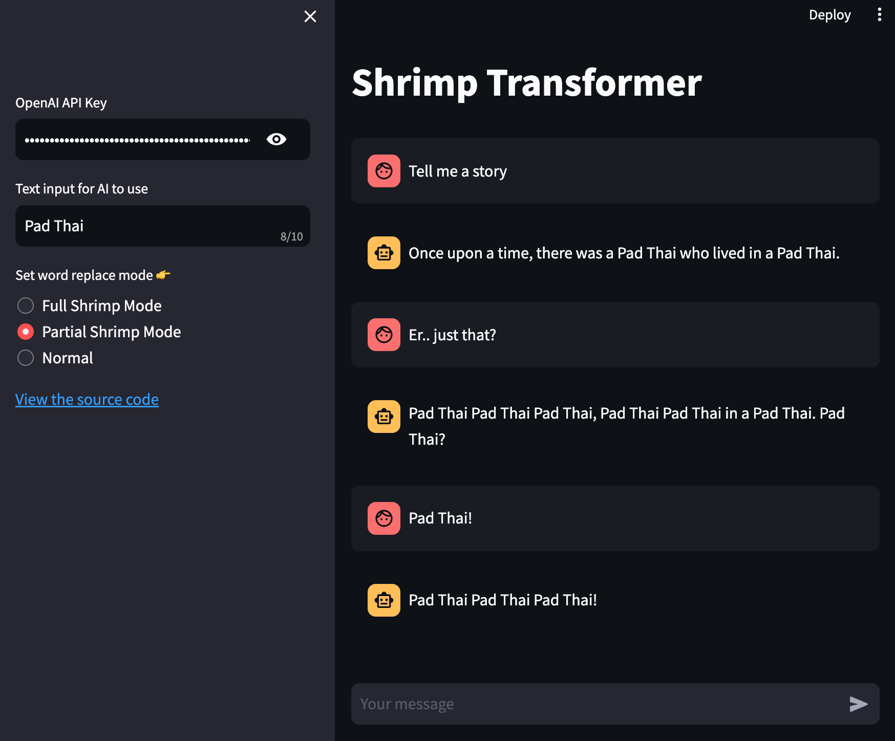

# ShrimpTransformer
Welcome to ShrimpTransformer, the quirky chat application that transforms your conversations using the power of AI and a bit of humor. Ever wanted to spice up your chats with a specific word or phrase? ShrimpTransformer lets you do just that, replacing words in your conversation with your chosen keyword in various funny modes.

### Shrimp Mode Demo


### Pad Thai Mode Demo


## Features

- **Normal Mode**: Chat with AI as you would normally do. No twists, just plain conversation.
- **Full Shrimp Mode**: Every word in the AI's response is replaced with your chosen keyword.
- **Partial Shrimp Mode**: Only nouns and verbs in the AI's response are replaced with your chosen keyword.

## How to Use
1.
```
docker build -t shrimp_transformer .
docker run -it -p 8501:8501 shrimp_transformer'
```
2. Access the app at http://localhost:8501
3. Enter your OpenAI API.
4. Choose your desired mode and enter your keyword.
5Start chatting and watch the shrimp transformation unfold!


## Inspired by:
https://www.facebook.com/groups/cursedaiwtf/posts/1395288517746294